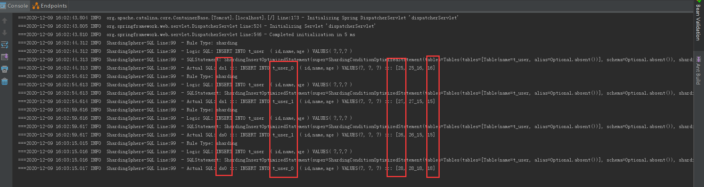
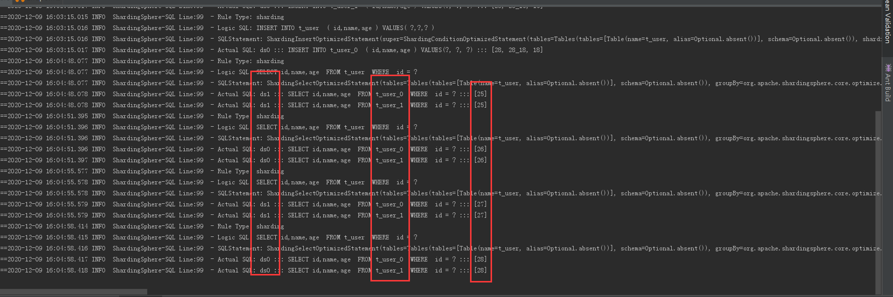
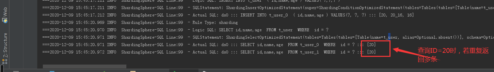

# springBoot + sharding-jdbc 实现分库分表DEMO
针对t_user表实现分库分表；而其他表仍是单库单表，默认保存到ds0中

##  功能特点
1.springBoot整合sharding-jdbc实现分库分表

2.springBoot整合通用mapper插件、XML以及注解方式，实现查询分页等

3.自定义日志输出

4.多配置环境切换，maven打包动态指定配置环境

5.接口(无论异常)统一格式输出

## 搭建步骤
 1. 执行document/db下的sql脚本，建立数据库(支持mysql5以上)
 2. 执行test目录下的测试单元
 
## 根据不同环境进行打包
例如 测试环境：
mvn clean package -Ptest -Dmaven.test.skip=true

## DEMO效果示例
插入例如：http://localhost:8080/user/add/{age}

查询例如：http://localhost:8080/user/{id}

## 注意事项
1. 注意引入的sharding-jdbc依赖版本，org.apache.shardingsphere和io.shardingsphere对应的配置文件配置不一样。不同版本配置文件其配置属性不同，即前缀不一样：spring.shardingsphere或sharding.jdbc。比如： spring.shardingsphere.datasource 和 sharding.jdbc.datasource 
2. 未配置分片规则的表将通过默认数据源定位-适用于单库单表，该表无需配置分片规则。
   spring.shardingsphere.sharding.default-data-source-name=ds0，配置该属性后不需要分库分表的都默认保存到ds0。
3. 分库分表时要保证主键ID全局唯一，否则不同表会出现重复，查询某个ID时会返回多条数据；若为单库单表，仍可使用数据库自带的自增方式进行配置即可。

